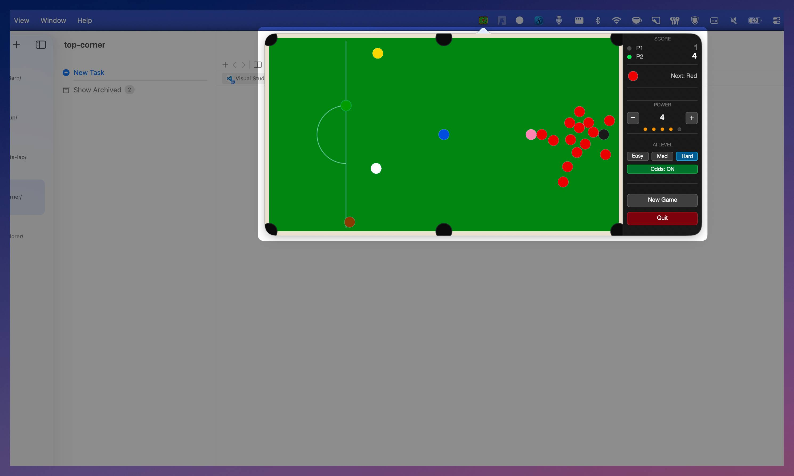

# Top Corner

> *Nobody has to know.*



A snooker game that lives in your macOS menu bar. Built with SpriteKit, no Xcode project required.


## Features

- Runs as a menu bar app — no Dock icon, no window clutter
- Full snooker table with 15 reds, 6 colours, and 6 pockets
- Click and drag the cue ball to aim and shoot
- Proper scoring: red → colour alternation, foul detection, colour clearance order
- Reset button restarts the frame at any time

## Requirements

- macOS 14 or later
- Xcode Command Line Tools (`xcode-select --install`)

## Install

Double-click `install.command`. It will:

1. Build a release binary with `swift build`
2. Assemble `TopCorner.app` in `~/Applications`
3. Launch the app

Or build and run directly:

```bash
swift build
.build/debug/TopCorner
```

## How to play

1. Click the `●` icon in the menu bar to open the table
2. Click and drag near the white cue ball to aim — drag further for more power
3. Release to shoot
4. Pot a red, then any colour, alternating until the reds are gone
5. Clear the colours in order: yellow, green, brown, blue, pink, black
6. Click outside the window to close it, or **Quit** to exit the app

## Scoring

| Ball   | Points |
|--------|--------|
| Red    | 1      |
| Yellow | 2      |
| Green  | 3      |
| Brown  | 4      |
| Blue   | 5      |
| Pink   | 6      |
| Black  | 7      |

Potting the cue ball or the wrong ball type is a foul and deducts points.

## Project structure

```
top-corner/
├── Package.swift                    # SPM build definition
├── Info.plist                       # LSUIElement — hides Dock icon
├── install.command                  # One-click build + install script
└── Sources/TopCorner/
    ├── main.swift                   # Entry point
    ├── AppDelegate.swift            # Menu bar status item + popover
    ├── GameViewController.swift     # Hosts the SKView
    └── SnookerScene.swift           # Game logic, physics, UI
```
